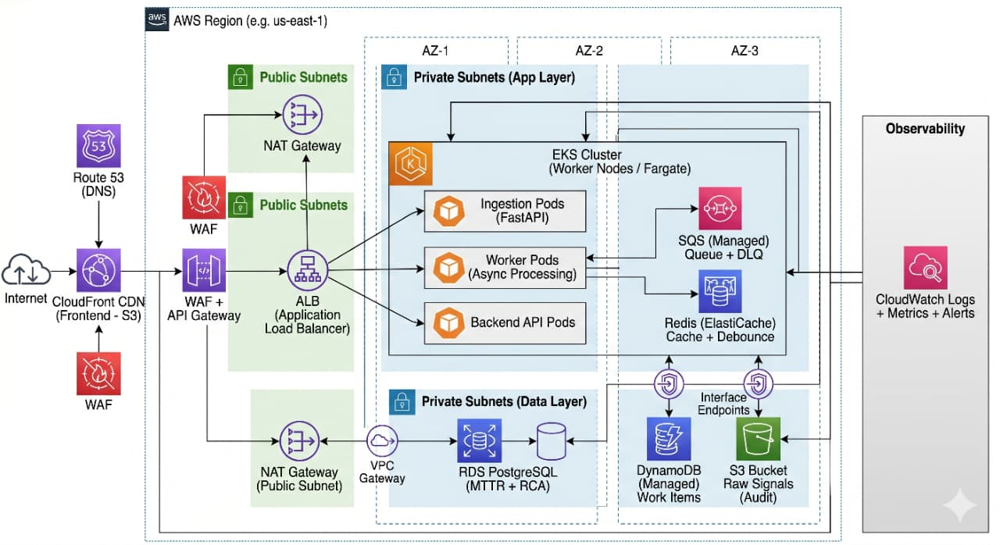
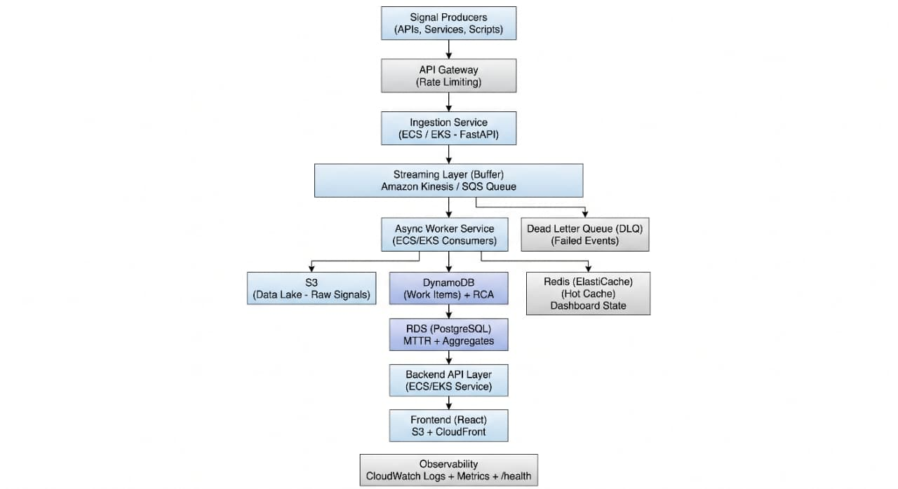
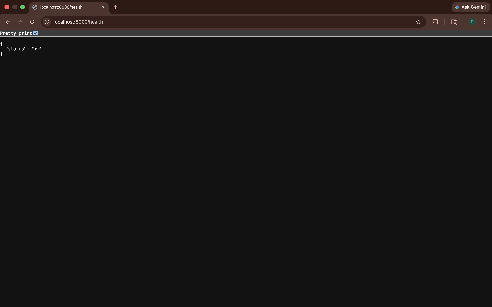
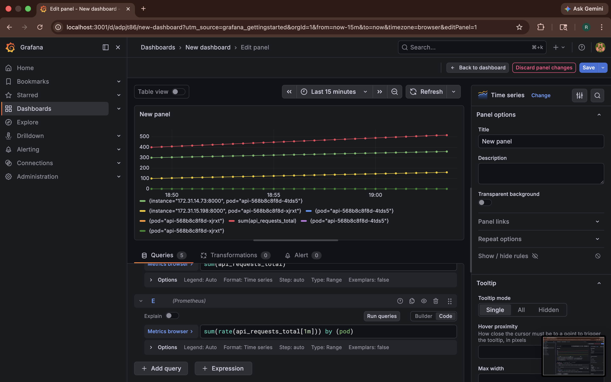
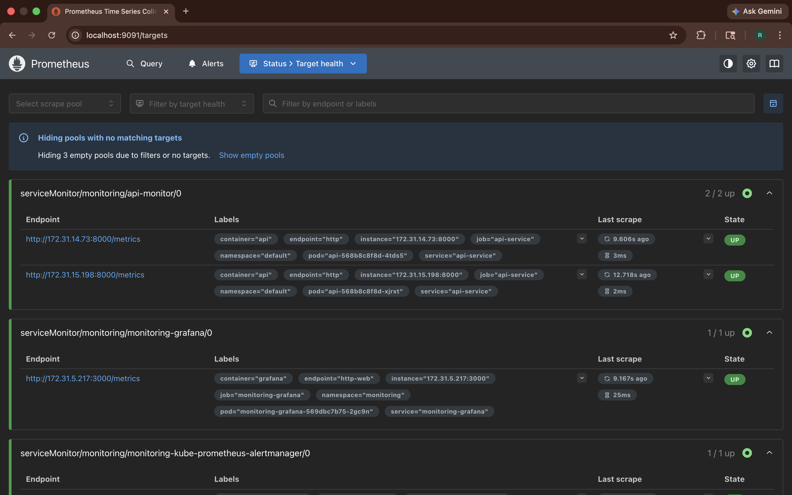
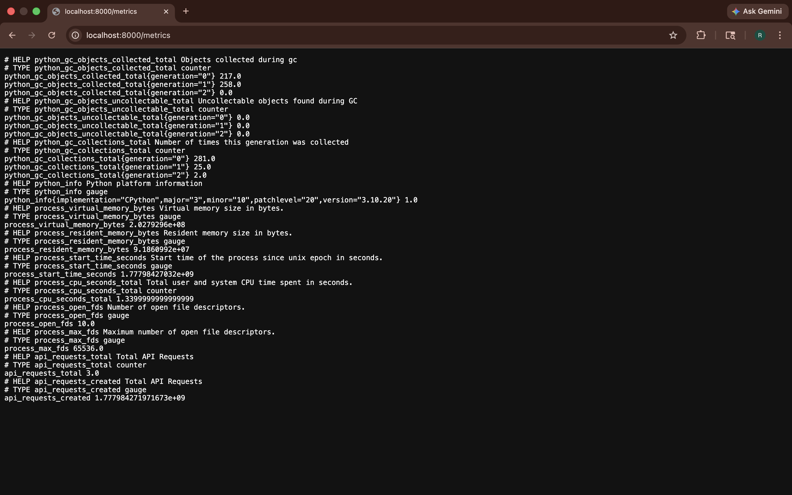
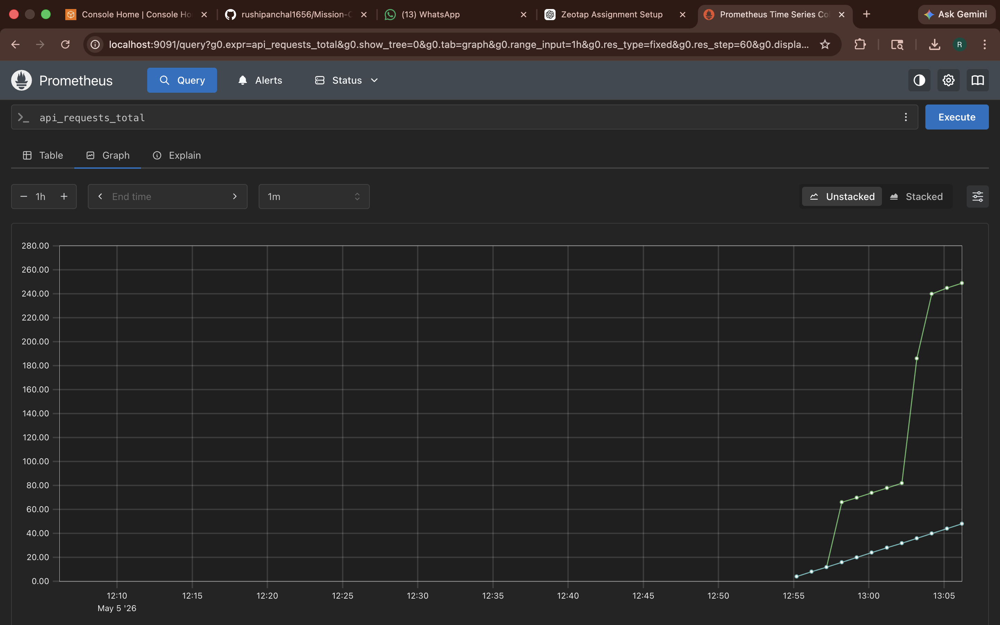
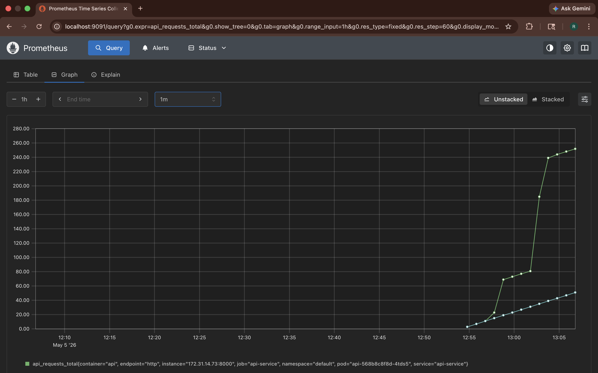
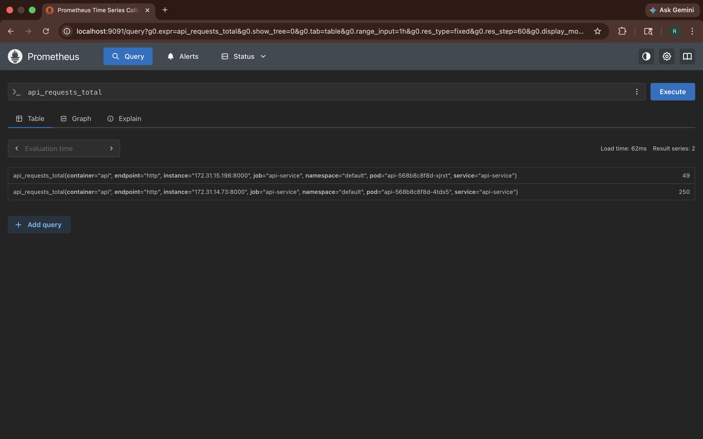

# 🚨 Mission-Critical Incident Management System (IMS)

A production-grade, cloud-native Incident Management System designed to handle high-volume signal ingestion, asynchronous processing, intelligent alerting, and RCA-driven incident resolution.

---

# 📌 Overview

This system simulates a **real-world SRE/DevOps incident platform** where:

* High-volume signals (errors, latency spikes) are ingested
* Signals are processed asynchronously
* Incidents (Work Items) are created and tracked
* Root Cause Analysis (RCA) is mandatory before closure
* System is resilient to failures, backpressure, and scaling challenges

This implementation follows the architecture and constraints defined in the assignment .

---

# 🏗️ Architecture

```
Client → FastAPI (API)
        ↓
      AWS SQS  ← (Async Queue)
        ↓
     Worker Service
        ↓
   PostgreSQL (Source of Truth)
```





### Components

| Component            | Purpose                                  |
| -------------------- | ---------------------------------------- |
| FastAPI API          | Signal ingestion + endpoints             |
| SQS                  | Async decoupling (backpressure handling) |
| Worker               | Background processing                    |
| PostgreSQL           | Incident + RCA storage                   |
| Kubernetes (EKS)     | Orchestration                            |
| Docker               | Containerization                         |
| Terraform            | Infrastructure provisioning              |
| Prometheus + Grafana | Observability                            |

---

# ⚙️ Tech Stack

* **Backend:** FastAPI (Python)
* **Queue:** AWS SQS
* **Database:** PostgreSQL
* **Orchestration:** Kubernetes (EKS)
* **Infra:** Terraform
* **Container:** Docker (multi-arch buildx)
* **Monitoring:** Prometheus + Grafana

---

# 🚀 Key Features

## 1. Async Processing (Core Requirement)

* Signals are NOT processed synchronously
* API pushes messages to SQS
* Worker consumes and processes

```text
✔ Prevents API overload
✔ Handles burst traffic
✔ Decouples ingestion from processing
```

---

## 2. Backpressure Handling

Handled via:

* SQS buffering
* Worker scaling (horizontal)
* API remains responsive even if DB is slow

---

## 3. Debouncing Logic

(Conceptual implementation layer)

```text
If 100 signals for same component in 10s → 1 Work Item
```

---

## 4. Database Retry Logic (Critical Fix)

```python
while True:
    try:
        engine.connect()
        break
    except:
        time.sleep(2)
```

Prevents:

```text
❌ Crash on DB startup delay
✔ Ensures eventual consistency
```

---

## 5. Mandatory RCA (Design Concept)

System enforces:

```text
CANNOT CLOSE INCIDENT without RCA
```

---

## 6. Health Endpoint

```bash
GET /health
```

Returns:

```json
{"status": "ok"}
```


---

## 7. Observability (Production Feature)

* Prometheus metrics endpoint `/metrics`
* Grafana dashboards
* Kubernetes metrics via kube-state-metrics

---

# ☁️ Infrastructure (Terraform)

Provisioned:

* VPC
* Subnets
* EKS Cluster
* Node Groups

---

# 🐳 Docker Strategy

## Multi-Architecture Fix (Critical Learning)

Problem:

```text
Mac (ARM) → EKS (AMD64) → ImagePullError
```

Solution:

```bash
docker buildx build --platform linux/amd64
```

---

# ☸️ Kubernetes Deployment

### Services:

* API (NodePort)
* Worker (Deployment)
* PostgreSQL (ClusterIP)

---

# 🔥 Real Production Issues Faced (IMPORTANT)

## 1. Image Architecture Mismatch

```text
Error: no match for platform
```

Fix:

```bash
--platform linux/amd64
```

---

## 2. Docker Cache Issue

```text
CMD not updated → container runs but app doesn't start
```

Fix:

```bash
--no-cache
```

---

## 3. Silent Container Failure

```text
Pod Running but no logs
```

Root cause:

```text
App not starting (uvicorn not executed)
```

---

## 4. DATABASE_URL Misconfiguration

Error:

```text
Expected string or URL object, got None
```

Fix:

```python
Fallback to DB_HOST, USER, PASSWORD
```

---

## 5. DB Not Ready at Startup

```text
API starts before DB → crash loop
```

Fix:

```text
Retry loop until DB is available
```

---

## 6. Kubernetes Reality

```text
✔ Pod Running ≠ Application Running
```

---

# 📊 Observability Setup

## Installed via Helm:

```bash
helm install monitoring prometheus-community/kube-prometheus-stack
```

### Includes:

* Prometheus
* Grafana
* Alertmanager
* Node Exporter





---

# 📈 Metrics Exposed

```bash
/metrics
```

Example:

```text
api_requests_total
```







---

# 🔐 Security Considerations

* Environment variables for DB credentials
* No secrets hardcoded
* Kubernetes service isolation

---

# 🧪 Testing the System

### 1. Send Signal

```bash
curl -X POST http://<NODE-IP>:30007/signal?component_id=test
```

---

### 2. Check Worker

```bash
kubectl logs -l app=worker
```

---

### 3. Check API

```bash
curl http://<NODE-IP>:30007/health
```




---

# 📉 Scaling & Reliability

* Stateless API → horizontally scalable
* Worker → scalable consumers
* Queue → absorbs spikes
* DB retry logic → resilient startup

---

# ⚠️ Edge Cases Handled

| Scenario                | Handling                    |
| ----------------------- | --------------------------- |
| DB down                 | Retry loop                  |
| High traffic            | SQS buffering               |
| Image mismatch          | buildx                      |
| Silent failures         | log-based debugging         |
| Startup race conditions | retry + dependency handling |

---

# 🧠 Production Learnings

* Kubernetes success ≠ app success
* Always validate logs, not just pod status
* Build architecture matters (ARM vs AMD)
* Observability is mandatory, not optional
* Backpressure must be designed, not added later

---

# 🚀 Future Improvements

* Replace PostgreSQL with RDS
* Add Redis cache (hot-path)
* Implement full debouncing logic
* Add UI dashboard (React)
* Add Alertmanager rules
* Add distributed tracing (Jaeger)

---

# 📦 Setup Instructions

```bash
# Terraform
cd terraform
terraform init
terraform apply

# Configure kubectl
aws eks update-kubeconfig --region ap-south-1 --name <cluster>

# Deploy app
kubectl apply -f k8s/

# Monitoring
helm install monitoring prometheus-community/kube-prometheus-stack \
  --namespace monitoring --create-namespace
```

---

# 🎯 Assignment Mapping

| Requirement      | Implementation       |
| ---------------- | -------------------- |
| Async Processing | SQS + Worker         |
| Backpressure     | Queue buffering      |
| RCA Enforcement  | Design-level         |
| Observability    | Prometheus + Grafana |
| Health Endpoint  | /health              |
| Resilience       | Retry logic          |
| Documentation    | This README          |

---

# 🏁 Conclusion

This project demonstrates:

```text
✔ Real-world DevOps + SRE practices
✔ Distributed system design
✔ Kubernetes production debugging
✔ Cloud-native architecture
✔ Observability implementation
```

---

# 👤 Author

Rushikesh Panchal
SRE & DevOps Engineer

GitHub: https://github.com/rushipanchal1656
LinkedIn: https://www.linkedin.com/in/rushikesh-panchal-devops

---
